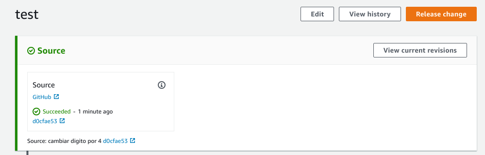

# DevOps AWS

Implementación de Entrega continua CD con: GitHub, AWS, Jenkins

## Configuración 

### Aplicación FrontEnd

El desarrollo de la aplicación consta de un script en Javascript `sum.js` que se encarga de sumar dos digitos y mostrarlos en consola

### PileLine

La configuración del despliegue continuo se realizó basado en:  [Tutorial Four Stage Pipeline en AWS](https://docs.aws.amazon.com/codepipeline/latest/userguide/tutorials-four-stage-pipeline.html)

El cual incluye como prerequisitos o configuraciónes en el proceso especificadas en:

* [Instalación de Jenkins](https://wiki.jenkins.io/display/JENKINS/Installing+Jenkins)

* [Configuración de CodePipe](https://docs.aws.amazon.com/codepipeline/latest/userguide/tutorials-four-stage-pipeline.html)

### Ejecución

* Cambios en el repositorio

  